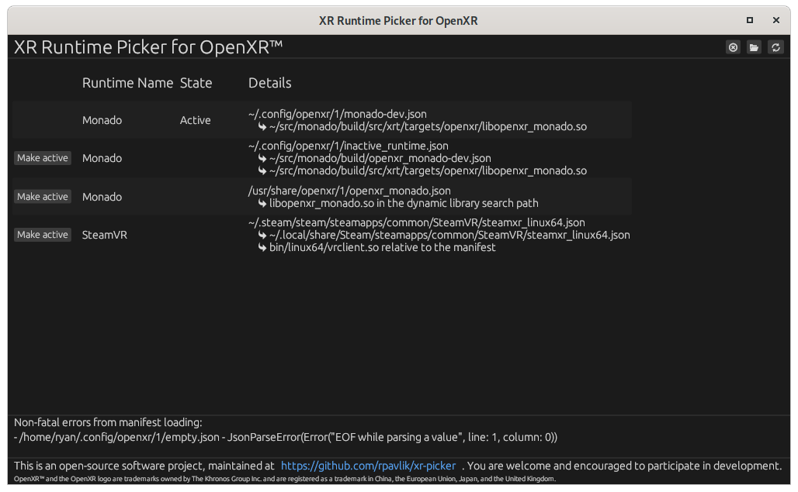

# XR Runtime Picker for OpenXR

<!--
Copyright 2023, Collabora, Ltd.
SPDX-License-Identifier: CC-BY-4.0
-->

This is a cross-platform tool to allow you to easily change your active
[OpenXR](https://khronos.org/openxr) runtime. (It also serves as a bit of a
testbed for Rust GUI techniques, though I use it "in production".)

Features include:

- Finding available runtimes
  - On Windows using the AvailableRuntimes registry key and a few hard-coded
    extras
  - On Linux by listing the files in the config directories
- Parsing runtime manifests for the runtime name, as well as adding names to
  select exceptions via heuristics.
- Working with additional runtimes manually added (by browsing to or
  drag-and-dropping a manifest) - useful for runtime developers.
- Remembering these extra runtimes between sessions.
- Identifying the active runtime (or runtimes in the case of Windows, 32 and 64
  bit).
- Setting the active runtime(s)
  - On Windows by setting the registry value/values
  - On Linux by setting a per-user symlink to the manifest.

Maintained at <https://github.com/rpavlik/xr-picker>.

## Installation and Use

- People using Windows can download a prebuilt release binary from
  [Releases][].
- People using Linux can also try a prebuilt release binary from [Releases][]
  (they should be fairly compatible, being built on Ubuntu 20.04), though you
  might need to build it locally if you have issues.
- On either platform, you can install from packaged source using Cargo, the Rust
  package manager, by running `cargo install xrpicker-gui`.
- If you have cloned the source, the normal Rust build and run process will work
  (`cargo build`, `cargo test`, `cargo run --bin xrpicker-gui`, etc.)

[Releases]: https://github.com/rpavlik/xr-picker/releases

## Structure

The tool is split into two Rust "crates":

- [`xrpicker-core`](xrpicker-core/), aka
  [`xrpicker` on crates.io](https://crates.io/crates/xrpicker), contains
  utilities for finding and manipulating runtimes, as well as
  framework-independent data structures intended for use in a GUI frontend.
  - It includes a very minimal (for now) CLI tool that can only list the active
    runtime and available runtimes: this will probably be upgraded eventually to
    be able to set the active runtime, in part so that the Windows GUI build can
    invoke it as administrator instead of having to run the whole GUI as
    administrator.
- [`xrpicker-gui`](xrpicker-gui/),
  ([`xrpicker-gui` on crates.io](https://crates.io/crates/xrpicker-gui)) is a
  cross-platform GUI frontend made using [egui](https://egui.rs).

## Development and Contribution

We welcome community contributions to this project. We have a
[Code of Conduct](CODE_OF_CONDUCT.md); by participating in this project you
agree to its terms.

CI enforces [REUSE][], [cargo-deny][], and simple build tests on Linux and
Windows. It is a bit hard to test even the core library because it works with
registry keys and the file system, and I have not yet investigated how to mock
these cleanly in Rust for automated testing.

[REUSE]: https://reuse.software/
[cargo-deny]: https://embarkstudios.github.io/cargo-deny/

## License

Licensed under either of the
[Apache License, Version 2.0](LICENSES/Apache-2.0.txt) or the
[MIT license](LICENSES/MIT.txt) at your option.

Unless you explicitly state otherwise, any contribution intentionally submitted
for inclusion in this crate by you, as defined in the Apache-2.0 license, shall
be dual licensed as above, without any additional terms or conditions.

This software conforms to the [REUSE specification](https://reuse.software).
